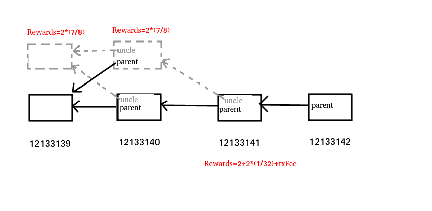

关于以太坊分叉

以12133139~12133141 临时性分叉为例
https://cn.etherscan.com/block/12133141

分叉
https://cn.etherscan.com/block/12133140/f

正规链
https://cn.etherscan.com/block/12133140




```
Block Height:
12133140
Timestamp:
10 mins ago (Mar-29-2021 08:43:09 AM +UTC)
Transactions:
234 transactions and 43 contract internal transactions in this block
Mined by:
0xd224ca0c819e8e97ba0136b3b95ceff503b79f53 (UUPool) in 1 secs
Block Reward:
3.333334064192265543 Ether (2 + 1.270834064192265543 + 0.0625)
Uncles Reward:
1.75 Ether (1 uncle at Position 0)
Difficulty:
6,234,646,087,607,443
Total Difficulty:
22,597,735,522,877,973,933,420
Size:
57,870 bytes
Gas Used:
12,473,144 (99.88%)
Gas Limit:
12,487,794
Extra Data:
uupool.cn-2 (Hex:0x7575706f6f6c2e636e2d32)
Hash:
0x3f22af765955918694b313b916c65dff229d63b34ece5326f3c86c9647ee5ec4
Parent Hash:
0x967595202026d7bd1028df47d8bb210620eecb93831204aa0e1300641b44f148
Sha3Uncles:
0xd90794e876e5aa6bb0ce5ac7c71471829ff2812e694937ffb473ebc8796b3b86
StateRoot:
0x1940d05d180acbea95178a8549198dbe2669014e3d7b0837e0898b10dcd11533
Nonce:
0xcdeec64907a0ca41
```


```
Block Height:
12133140
Timestamp:
13 mins ago (Mar-29-2021 08:43:08 AM +UTC)
Re-Org Depth:
1 block back
Mined by:
0x52bc44d5378309ee2abf1539bf71de1b7d7be3b5 (Nanopool) in 2 secs
Block Reward:
3.285617825065742637 Ether (2 + 1.223117825065742637 + 0.0625)  // 其中  0.0625 是  2 * 1/32 的区块奖励
Uncles Reward:
1.75 Ether (1 uncle at Position 0) // 1.75 ehter是叔块(矿工)获得的奖励  2 * 7/8 = 1.75 ether
Difficulty:
6,234,646,087,607,443
Total Difficulty:
22,597,735,522,877,973,933,420
Size:
54,705 bytes
Gas Used:
12,505,179 (99.94%)
Gas Limit:
12,512,206
Extra Data:
nanopool.org (Hex:0x6e616e6f706f6f6c2e6f7267)
Hash:
0x4b2f8978d12d623612cc07c7ae1877ee496a024dd00a5446639296869e303d02
Parent Hash:
0x967595202026d7bd1028df47d8bb210620eecb93831204aa0e1300641b44f148
Sha3Uncles:
0xd90794e876e5aa6bb0ce5ac7c71471829ff2812e694937ffb473ebc8796b3b86
StateRoot:
0xba2ef7b9483c82aee42afcc6fb0659efd1f69a9bbdfe6a61785554b1094479d0
Nonce:
0xe99052746711103e
```

叔块
```
Uncle Height:
12133139
Uncle Position:
0
Block Height:
12133140
Hash:
0x665b767e131d93f1ba21c529b414e5e644c7b3d1e8838b8ddccb168040ff1422
Parent Hash:
0xf73c0ba41050535ceef6a34b49256a049e4bc3f4961de7816342e1ca6f341f86
Sha3Uncles:
0x1dcc4de8dec75d7aab85b567b6ccd41ad312451b948a7413f0a142fd40d49347
Mined by:
0xea674fdde714fd979de3edf0f56aa9716b898ec8 (Ethermine) in 2 secs
Difficulty:
6,231,602,775,943,590
Gas Limit:
12,493,751 Wei
Gas Used:
12,492,869 Wei
Timestamp:
 16 mins ago (3/29/2021 8:43:06 AM +UTC)
Uncle Reward:
1.75 Ether
```


